# 🔐 IntraCorp Portal - Sistem IT Helpdesk

## 📋 Deskripsi Sistem

**IntraCorp Portal** adalah aplikasi web berbasis PHP untuk manajemen internal perusahaan yang mencakup manajemen user, sistem pengumuman (announcements), dan IT support ticketing system. Sistem ini dibangun dengan arsitektur MVC custom tanpa framework, menggunakan PHP native untuk kemudahan pembelajaran.

⚠️ **CATATAN PENTING:** Aplikasi ini sengaja dibuat dengan berbagai kerentanan keamanan untuk keperluan **security training & penetration testing**. **JANGAN deploy ke production environment!**

---

---

## 👥 User Roles & Akses

### 1. **Administrator (Admin/IT Staff)**

**Hak Akses:**

- ✅ Full access ke admin panel
- ✅ Manage semua users (create, edit, delete, activate/suspend)
- ✅ Create, edit, delete announcements
- ✅ View dan manage semua IT support tickets
- ✅ Assign tickets ke IT staff
- ✅ Update ticket status dan priority
- ✅ Add comments/replies ke semua tickets
- ✅ Close tickets
- ✅ View dashboard analytics

### 2. **Employee (Karyawan Biasa)**

**Hak Akses:**

- ✅ View personal dashboard
- ✅ View semua announcements
- ✅ Create IT support tickets
- ✅ View dan track tickets yang dibuat
- ✅ Add comments ke tickets sendiri
- ✅ Update profile pribadi
- ✅ Upload profile picture
- ✅ Change password

## 🎨 Fitur-Fitur Sistem

### 📊 1. Dashboard

#### Admin Dashboard

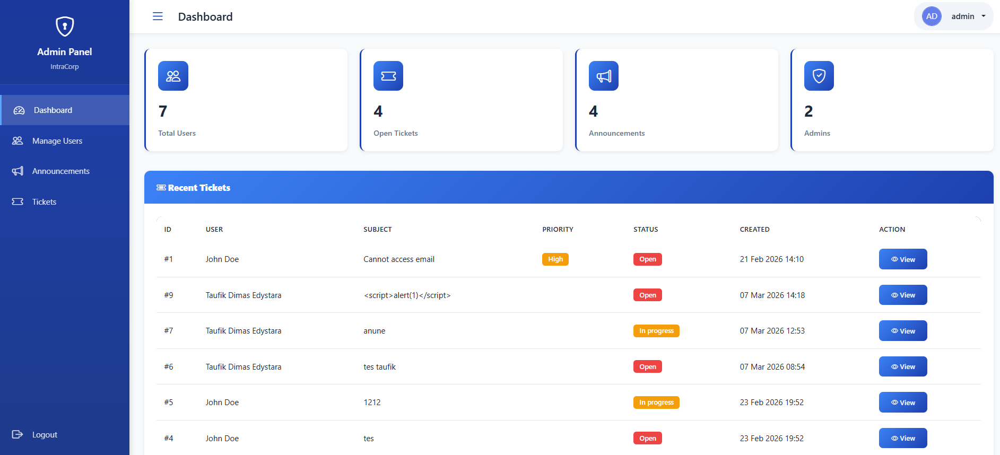

**Fitur:**

- 📈 **Statistics Overview**
  - Total users aktif
  - Total announcements
  - Total tickets (Open, In Progress, Closed)
  - Activity metrics
- 📋 **Recent Activities**
  - Latest registered users
  - Recent announcements
  - Latest tickets
  - System activities

- 🔔 **Quick Actions**
  - Create new user
  - Create announcement
  - View pending tickets
  - System settings

#### Employee Dashboard

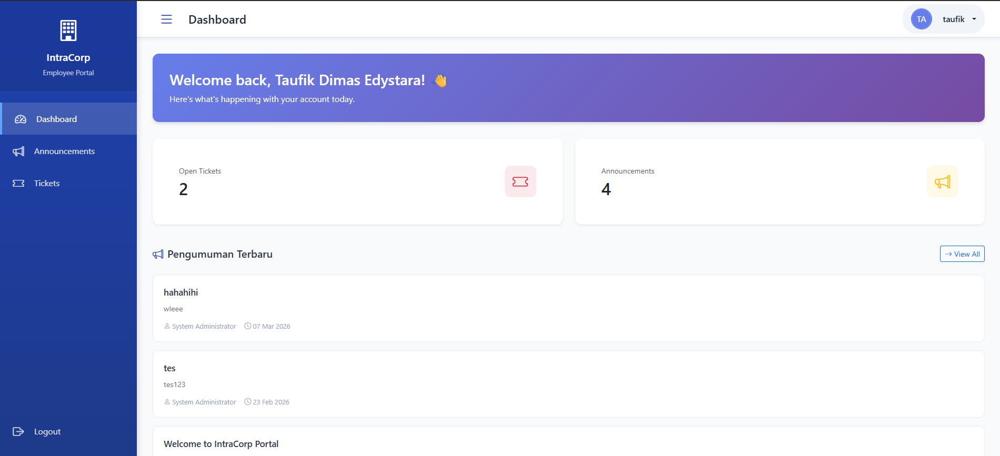

**Fitur:**

- 📢 **Latest Announcements** - 5 pengumuman terbaru
- 🎫 **My Tickets** - Status tickets yang dibuat
- 👤 **Profile Summary** - Info personal dan department
- 🔔 **Notifications** - Update tickets dan announcements
- ⚡ **Quick Actions**
  - Create new ticket
  - View all announcements
  - Edit profile

---

### 🔐 2. Authentication System

#### Login Page

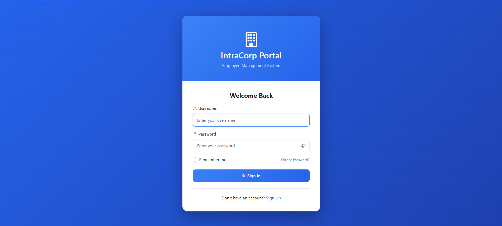

**Fitur:**

- 📧 Email/username login
- 🔒 Password authentication
- 🔄 Remember me option
- 🔗 Forgot password link
- 👤 Role-based redirect (Admin → Admin Panel, Employee → Dashboard)

**Kerentanan (Intentional):**

- ❌ SQL Injection pada login form
- ❌ No rate limiting (brute force possible)
- ❌ Plain text password storage
- ❌ User enumeration via error messages

#### Registration Page

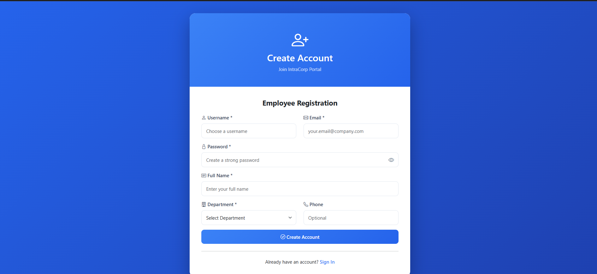

**Fitur:**

- 📝 Full name, email, username
- 🏢 Department selection
- 📞 Phone number (optional)
- 🔒 Password creation
- ✅ Auto-registration sebagai Employee role

**Kerentanan (Intentional):**

- ❌ No email verification
- ❌ SQL Injection pada registration
- ❌ No password strength validation
- ❌ No CAPTCHA (bot registration possible)

---

### 📢 3. Announcement System

#### View Announcements (Employee)

**Fitur:**

- 📋 List semua announcements
- 🔍 Search announcements
- 📅 Sort by date
- 👁️ View announcement details
- 📎 Download attachments
- 💬 View announcement details

#### Announcement Detail

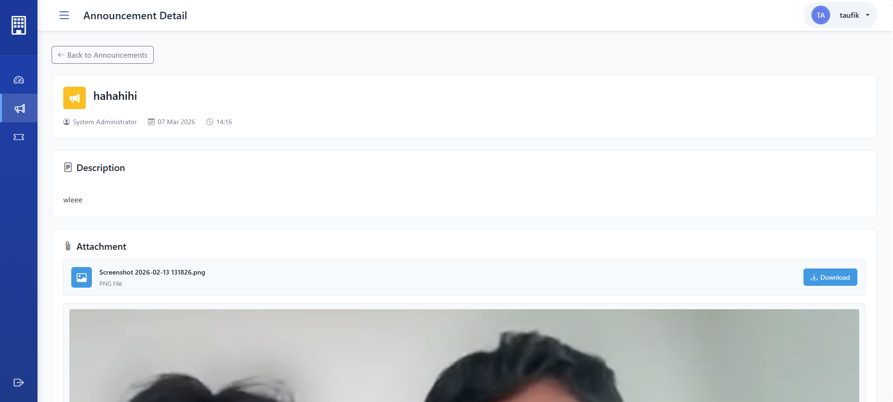

**Fitur:**

- 📄 Full announcement content
- 👤 Created by (Author info)
- 📅 Published date
- 📎 File attachments (jika ada)
- 🖼️ Image preview untuk attachment gambar
- ↩️ Back to announcements list

#### Admin - Manage Announcements

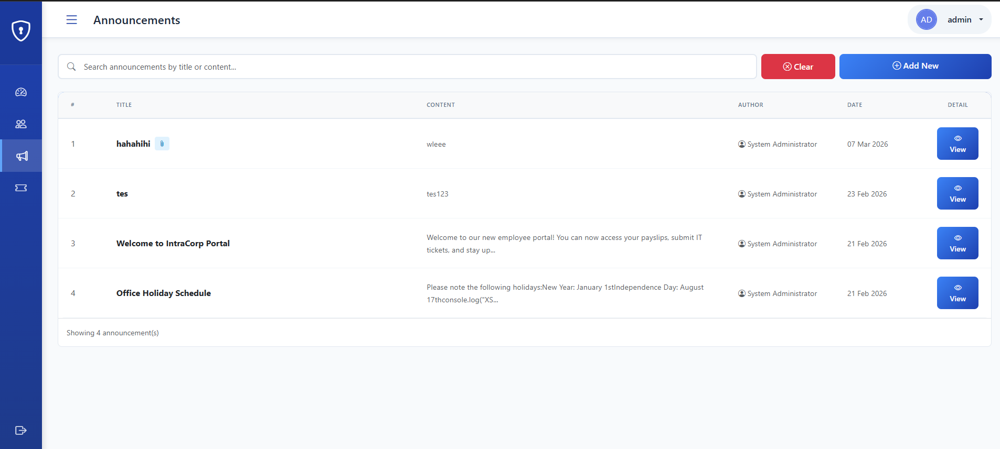

**Fitur:**

- 📋 List semua announcements
- 🔍 Search by title/content
- ✏️ Edit announcements
- 🗑️ Delete announcements
- ➕ Create new announcement
- 👁️ View details
- 📊 View statistics (views, engagement)

#### Admin - Create Announcement

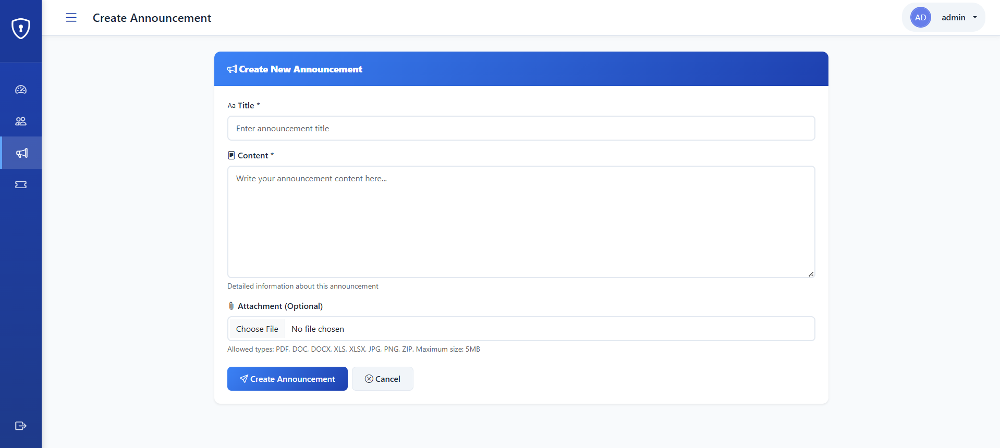

**Fitur:**

- 📝 Title dan content (Rich text)
- 📎 File attachment upload
- 👤 Auto-assign author (current admin)
- 📅 Timestamp otomatis
- ✅ Publish immediately

**Kerentanan (Intentional):**

- ❌ Stored XSS di content
- ❌ No file upload validation
- ❌ No CSRF protection
- ❌ File stored in database (BLOB)

---

### 🎫 4. IT Support Ticket System

#### Employee - My Tickets

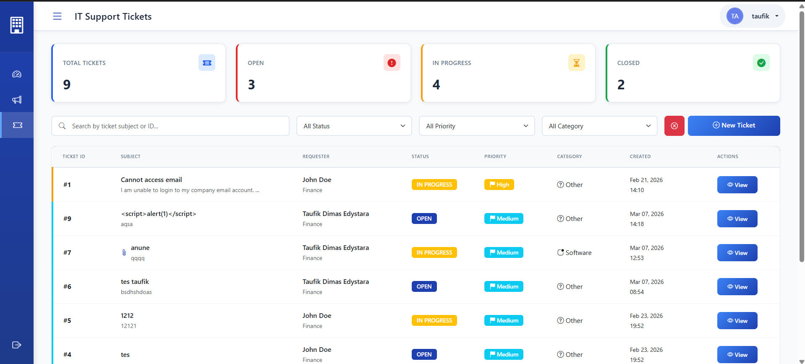

**Fitur:**

- 📋 List tickets yang dibuat
- 🏷️ Status badges (Open, In Progress, Closed)
- 🚨 Priority indicators (Low, Medium, High, Critical)
- 📂 Category icons (Hardware, Software, Network, etc.)
- 🔍 Search dan filter tickets
- 📊 Ticket statistics
- ➕ Create new ticket

**Filter Options:**

- Status: Open, In Progress, Closed
- Priority: Critical, High, Medium, Low
- Category: Hardware, Software, Network, Access, Email, Other
- Search: By subject atau description

#### Employee - Create Ticket

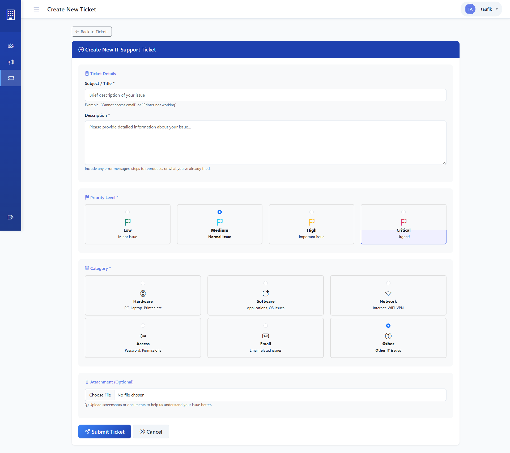

**Fitur:**

- 📝 **Subject** - Judul masalah
- 📋 **Description** - Detail masalah (textarea)
- 🚨 **Priority Selection**
  - 🔴 Critical - System down/urgent
  - 🟠 High - Important issue
  - 🟡 Medium - Normal issue
  - 🟢 Low - Minor issue
- 📂 **Category Selection**
  - 💻 Hardware - PC, printer, peripheral issues
  - 📱 Software - Application problems
  - 🌐 Network - Internet, connectivity
  - 🔑 Access - Login, permissions
  - 📧 Email - Email issues
  - ❓ Other - Miscellaneous
- 📎 **File Attachment** - Upload screenshot/document
- ✅ Submit ticket

**Kerentanan (Intentional):**

- ❌ XSS di description field
- ❌ File upload vulnerability
- ❌ No CSRF protection

#### Employee - Ticket Detail

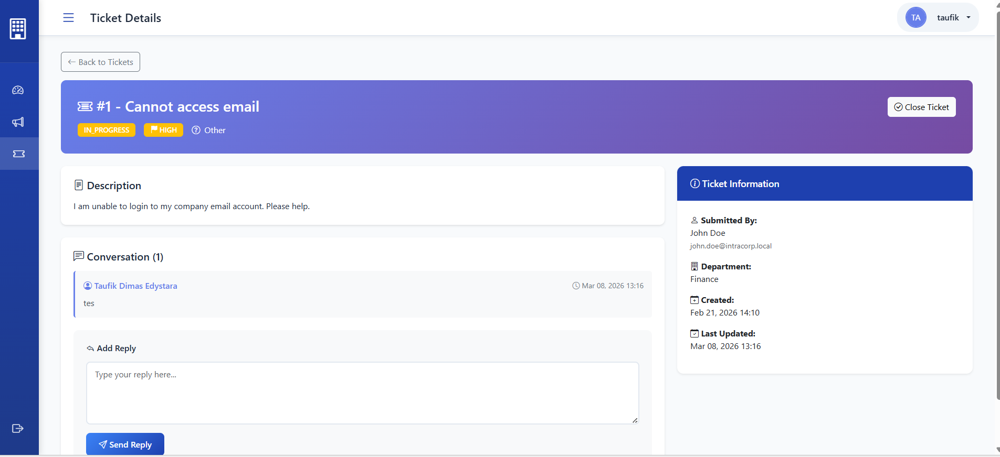

**Fitur:**

- 📄 **Ticket Header**
  - Ticket ID (#)
  - Subject
  - Status badge
  - Priority badge
  - Category
- 📝 **Ticket Body**
  - Full description
  - Attached files
  - Image preview
- 💬 **Comments/Conversation**
  - View all comments
  - Add reply
  - See IT staff responses
  - Timestamp per comment
- ℹ️ **Ticket Information Sidebar**
  - Submitted by
  - Department
  - Created date
  - Last updated
  - Assigned to (IT staff)
  - Status
- 🔒 **Actions**
  - Add comment (if open)
  - Close ticket (owner only)

#### Admin - All Tickets

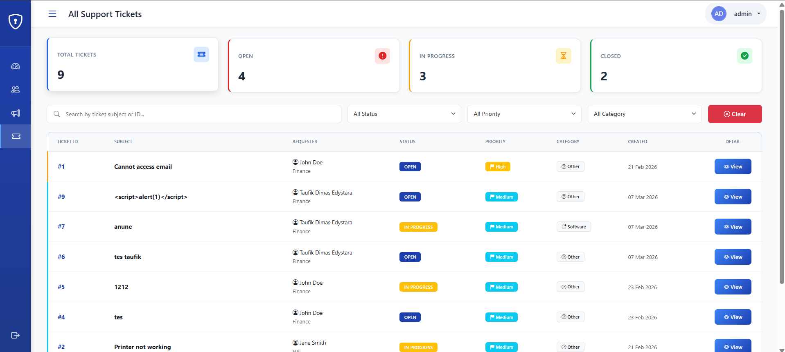

**Fitur:**

- 📋 View semua tickets dari semua users
- 🔍 Advanced filtering
  - By status
  - By priority
  - By category
  - By assigned staff
  - By user/department
- 📊 **Statistics Dashboard**
  - Total tickets
  - Open tickets count
  - In Progress count
  - Closed tickets count
  - Average response time
- 👁️ View ticket details
- ✏️ Update ticket status
- 👤 Assign to IT staff
- 🚨 Change priority

#### Admin - Ticket Detail

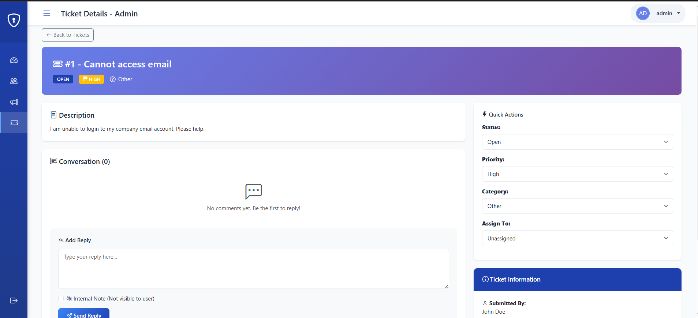

**Fitur Admin:**

- 📝 View full ticket details
- 💬 **Internal Notes** - Private comments untuk IT staff
- 👥 **Assignment**
  - Assign ticket ke IT staff
  - Re-assign ke staff lain
  - Unassign ticket
- 🚨 **Update Priority**
  - Change priority level
  - Add reason for change
- 📊 **Update Status**
  - Open → In Progress
  - In Progress → Closed
  - Close with resolution notes
- 📂 **Change Category**
- 💬 **Public Comments** - Reply visible ke user
- 🔒 **Close Ticket** - Mark as resolved

**Comment Features:**

- ✅ Public comments (visible to ticket owner)
- 🔒 Internal notes (visible to IT staff only)
- 👤 Author identification (name, role badge)
- 📅 Timestamp
- 💬 Thread view

---

### 👥 5. User Management (Admin Only)

#### Manage Users

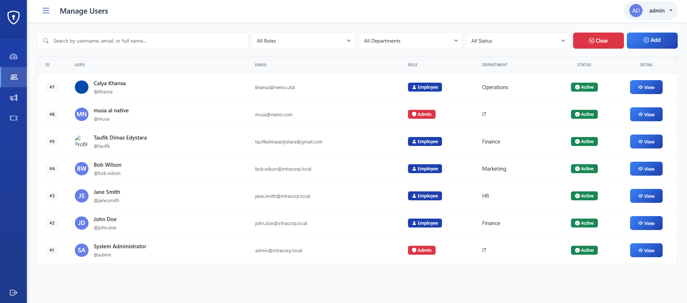

**Fitur:**

- 📋 **User List Table**
  - ID, Username, Full Name
  - Email, Department
  - Role (Admin/Employee)
  - Status (Active/Suspended)
  - Last login
  - Created date
- 🔍 **Search & Filter**
  - Search by name/email/username
  - Filter by role (Admin/Employee)
  - Filter by department
  - Filter by status (Active/Suspended)
- ⚡ **Quick Actions**
  - 👁️ View user details
  - ✏️ Edit user
  - 🗑️ Delete user
  - 🔒 Suspend/Activate account
- 📊 **Statistics**
  - Total users
  - Active users
  - Suspended users
  - Admins count
  - Employees count
- ➕ **Create New User**

**Kerentanan (Intentional):**

- ❌ IDOR - View any user via ID manipulation
- ❌ CSRF pada delete user
- ❌ No confirmation untuk destructive actions
- ❌ User enumeration possible

#### Create User

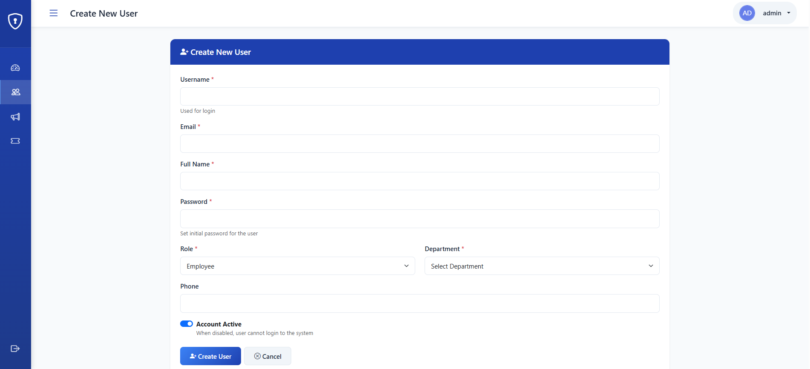

**Fitur:**

- 📝 **User Information**
  - Username (unique)
  - Email address
  - Full name
  - Phone number
- 🏢 **Organization Details**
  - Department selection
  - Job title (optional)
- 👤 **Account Settings**
  - Role selection (Admin/Employee)
  - Password creation
  - Account status (Active/Inactive)
- ✅ **Create & Send Credentials**
  - Auto-generate password option
  - Email credentials (optional)

**Validasi:**

- ❌ No email format validation (intentional)
- ❌ No username uniqueness check
- ❌ Weak password allowed
- ❌ SQL Injection possible

#### View User Details

**Fitur:**

- 👤 **Profile Information**
  - Profile picture
  - Full name, username
  - Email, phone
  - Department, job title
- 📊 **Activity History**
  - Tickets created (count)
  - Last login
  - Account created date
  - Last password change
- 🎫 **User's Tickets**
  - List of tickets created by user
  - Ticket statistics
  - Quick view ticket
- 🔐 **Account Settings**
  - Account status
  - Role
  - Permissions
- ⚡ **Admin Actions**
  - Edit profile
  - Reset password
  - Suspend/Activate
  - Delete account
  - View audit log

---
